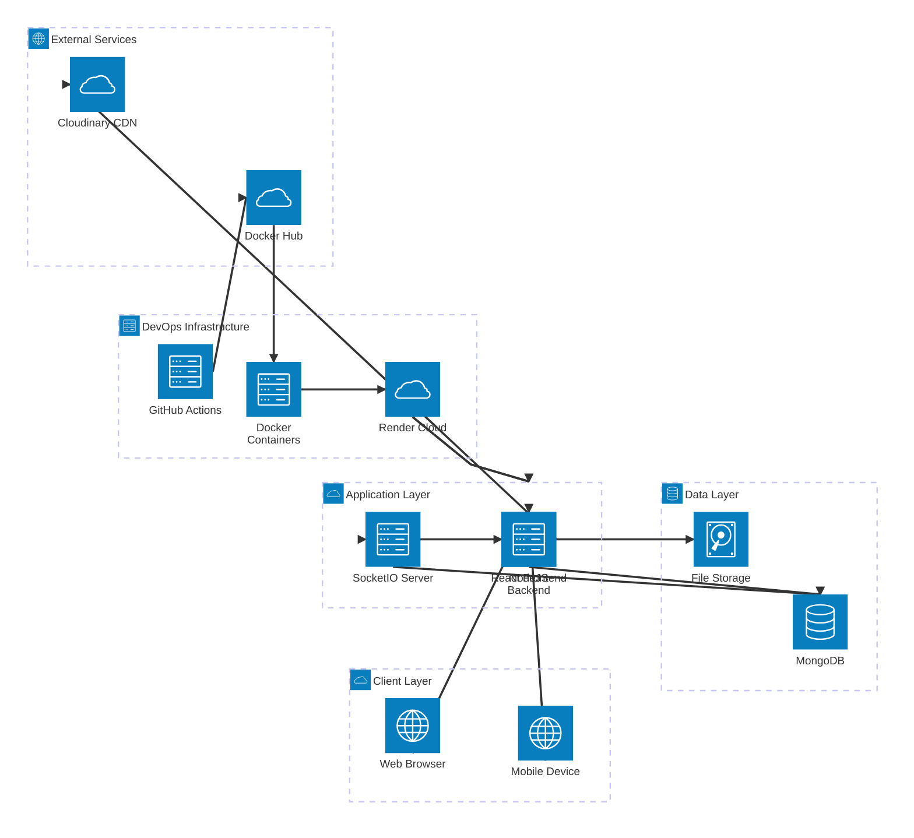
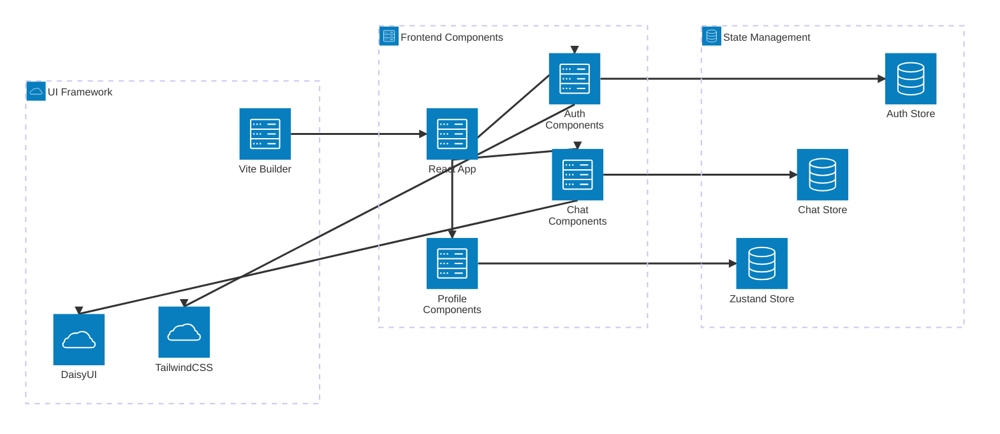
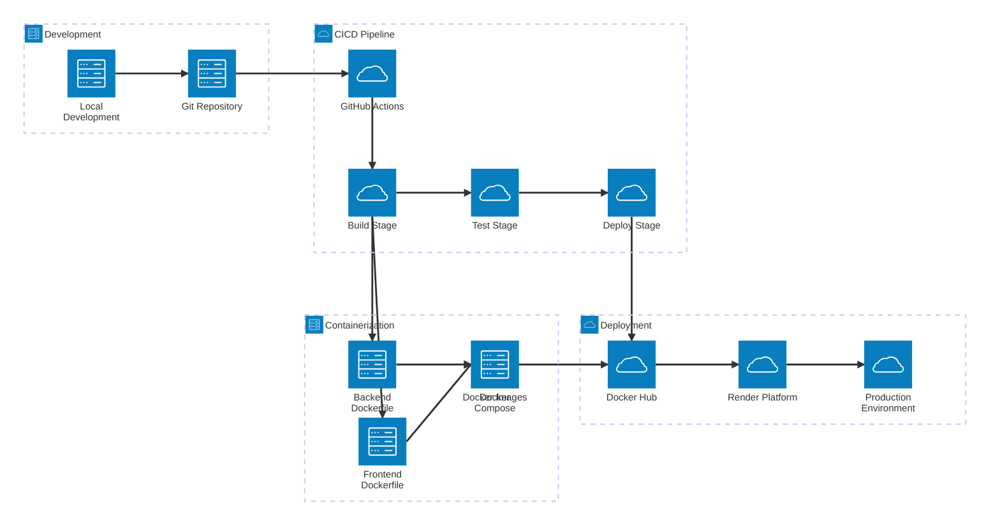
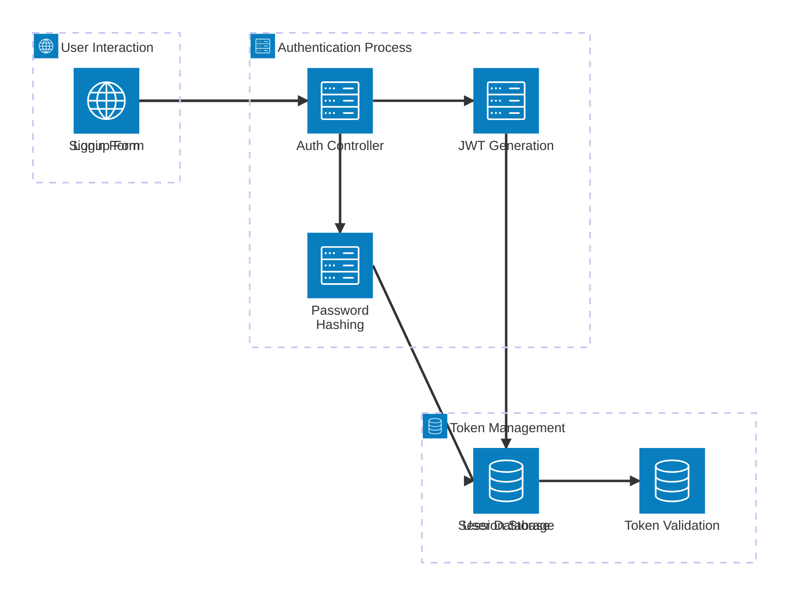
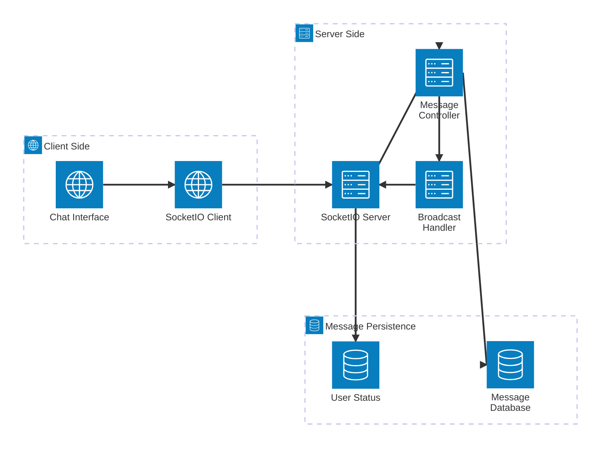
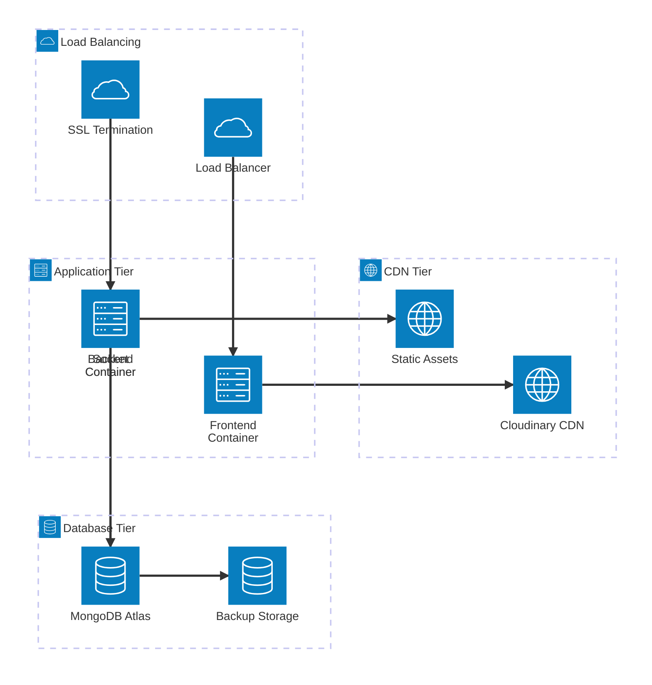

# Chat Application - Architecture Diagram

This document contains the architecture diagram for the full-stack chat application, showing the relationship between different services, infrastructure components, and data flow.

## System Architecture Overview

The architecture follows a containerized microservices approach with CI/CD pipeline integration, demonstrating modern DevOps practices and scalable design patterns.

## Architecture Diagram

## Detailed Component Flow

### Frontend Layer (React Application)

### Backend Layer (NodeJS Application)

### DevOps and Deployment Pipeline

## Data Flow Architecture

### Authentication Flow

### Real-time Messaging Flow

## Technology Stack Mapping

### Frontend Stack
- **ReactJS**: Component-based UI development
- **Vite**: Fast build tool and development server
- **Zustand**: Lightweight state management
- **TailwindCSS**: Utility-first styling
- **DaisyUI**: Pre-built component library
- **SocketIO Client**: Real-time communication

### Backend Stack
- **NodeJS**: JavaScript runtime environment
- **ExpressJS**: Web framework for API development
- **MongoDB**: NoSQL database for data storage
- **Mongoose**: Object Document Mapping (ODM)
- **SocketIO**: Real-time bidirectional communication
- **JWT**: JSON Web Tokens for authentication
- **bcrypt**: Password hashing and security

### DevOps Stack
- **Docker**: Containerization platform
- **Docker Compose**: Multi-container orchestration
- **GitHub Actions**: CI/CD automation
- **Docker Hub**: Container registry
- **Render**: Cloud hosting platform

### External Services
- **Cloudinary**: Image storage and CDN
- **MongoDB Atlas**: Cloud database hosting

## Security Architecture

### Security Layers

## Deployment Architecture

### Production Environment

---

## Architecture Benefits

### Scalability
- **Horizontal Scaling**: Containerized services can be scaled independently
- **Load Distribution**: Multiple instances can handle increased traffic
- **Database Scaling**: MongoDB supports sharding and read replicas

### Maintainability
- **Separation of Concerns**: Clear separation between frontend, backend, and database
- **Modular Design**: Each component has specific responsibilities
- **Version Control**: Docker images ensure consistent deployments

### Security
- **Multi-layer Security**: Authentication, authorization, and data validation
- **Encrypted Communication**: HTTPS/SSL for all external communications
- **Environment Isolation**: Containerization provides security isolation

### Performance
- **CDN Integration**: Fast image delivery through Cloudinary
- **Optimized Builds**: Vite provides fast development and optimized production builds
- **Real-time Communication**: Socket.IO for instant messaging without polling

This architecture demonstrates modern full-stack development practices with emphasis on scalability, security, and maintainability.
